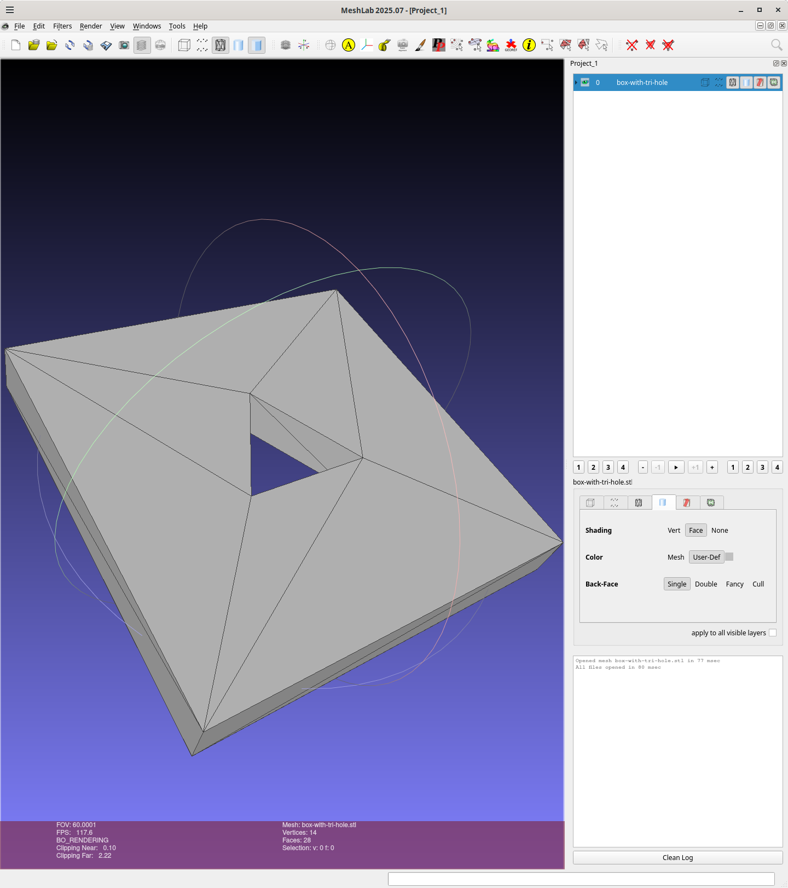

# Box with trianglular hole

A 40x40x5mm box with a triangular hole circumscribed by a circle with a 7.5mm radius:

Implemented using `FreeCAD 1.0.2 Revision 39319 (Git)`
which was installed using pacman package
[freecad-1.0.2-6](https://archlinux.org/packages/extra/x86_64/freecad/)

Meshlab Compute Topological Measures
```
wink@3900x 25-11-27T19:11:44.470Z:~/data/prgs/3dprinting/box-with-tri-hole/FreeCAD (main)
$ meshlab box-with-tri-hole.stl
Using OpenGL 4.6
LOG: 0 Opened mesh box-with-tri-hole.stl in 58 msec
LOG: 0 All files opened in 60 msec
LOG: 2 V:     14 E:     42 F:    28
LOG: 2 Unreferenced Vertices 0
LOG: 2 Boundary Edges 0
LOG: 2 Mesh is composed by 1 connected component(s)

LOG: 2 Mesh is two-manifold
LOG: 2 Mesh has 0 holes
LOG: 2 Genus is 1
LOG: 0 Applied filter: Compute Topological Measures in 264 msec
wink@3900x 25-11-27T19:15:04.081Z:~/data/prgs/3dprinting/box-with-tri-hole/FreeCAD (main)
```


