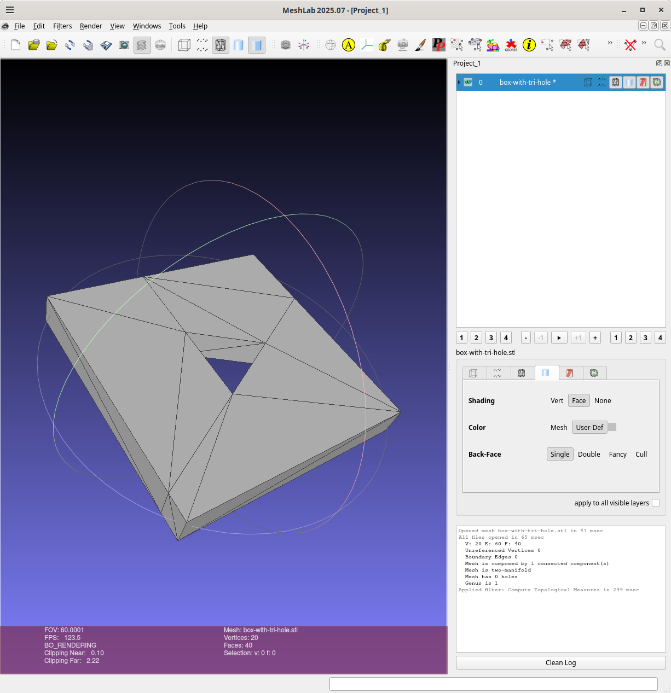

# box-with-tri-hole

A 40x40x5mm box with a triangular hole circumscribed by a circle with a 7.5mm radius:

Implemented using [csgrs](https://git@github.com:timschmidt/csgrs), CAD kernel
written in Rust.

The src/main.rs is based on [csgrs-holed-cuboid](https://git@github.com:winksaville/csgrs-holed-cuboid)

## Usage

Here I'm running after having done a clean and it creates `box-with-tri-hole.stl`:
```
wink@3900x 25-11-28T19:42:46.814Z:~/data/prgs/3dprinting/box-with-tri-hole/csgrs (main)
$ cargo clean
     Removed 4313 files, 1.7GiB total
wink@3900x 25-11-28T19:43:04.388Z:~/data/prgs/3dprinting/box-with-tri-hole/csgrs (main)
$ cargo run --release
   Compiling proc-macro2 v1.0.103
   Compiling unicode-ident v1.0.22
   Compiling quote v1.0.42
   Compiling autocfg v1.5.0
   Compiling libm v0.2.15
..

   Compiling geo-buf v0.1.0
   Compiling parry3d-f64 v0.19.0
   Compiling rapier3d-f64 v0.24.0
   Compiling csgrs v0.20.1 (https://github.com/timschmidt/csgrs.git?rev=278e0254d2c8bfffe2e9021fd8120dd9ee1f60bb#278e0254)
   Compiling box-with-tri-hole v0.1.0 (/home/wink/data/prgs/3dprinting/box-with-tri-hole/csgrs)
    Finished `release` profile [optimized] target(s) in 11.80s
     Running `target/release/box-with-tri-hole`
Writing file: box-with-tri-hole.stl
wink@3900x 25-11-28T19:43:32.004Z:~/data/prgs/3dprinting/box-with-tri-hole/csgrs (main)
```

Using meshlab to inspect the object using menus
[filters -> Quality Measures and Computations -> Compute Topological Measures]
and the result is imperfect :(
```
wink@3900x 25-11-28T20:20:29.005Z:~/data/prgs/3dprinting/box-with-tri-hole/csgrs (main)
$ meshlab box-with-tri-hole.stl 
Using OpenGL 4.6
LOG: 0 Opened mesh box-with-tri-hole.stl in 51 msec
LOG: 0 All files opened in 58 msec
LOG: 2 V:     20 E:     58 F:    28
LOG: 2 Unreferenced Vertices 0
LOG: 2 Boundary Edges 32
LOG: 2 Mesh is composed by 4 connected component(s)

LOG: 2 Mesh has 12 non two manifold vertices and 24 faces are incident on these vertices

LOG: 2 Mesh has a undefined number of holes (non 2-manifold mesh)
LOG: 2 Genus is undefined (non 2-manifold mesh)
LOG: 0 Applied filter: Compute Topological Measures in 292 msec
^C
wink@3900x 25-11-28T20:22:11.671Z:~/data/prgs/3dprinting/box-with-tri-hole/csgrs (main)
```

Here is a png:


## Binary

The binary is 532,552 bytes:
```
wink@3900x 25-11-28T19:43:32.004Z:~/data/prgs/3dprinting/box-with-tri-hole/csgrs (main)
$ ls -l target/release/box-with-tri-hole
-rwxr-xr-x 2 wink users 532552 Nov 28 11:43 target/release/box-with-tri-hole
wink@3900x 25-11-28T19:45:43.871Z:~/data/prgs/3dprinting/box-with-tri-hole/csgrs (main)
```

Bloat info on the binary crates:
```
$ cargo bloat --crates target/release/box-with-tri-hole
Warning: unused arguments left: ["target/release/box-with-tri-hole"].
   Compiling either v1.15.0
   Compiling stable_deref_trait v1.2.1
   Compiling cfg-if v1.0.4
   Compiling log v0.4.28
   Compiling smallvec v1.15.1
..
   Compiling dxf v0.6.0
   Compiling rapier3d-f64 v0.24.0
   Compiling csgrs v0.20.1 (https://github.com/timschmidt/csgrs.git?rev=278e0254d2c8bfffe2e9021fd8120dd9ee1f60bb#278e0254)
   Compiling box-with-tri-hole v0.1.0 (/home/wink/data/prgs/3dprinting/box-with-tri-hole/csgrs)
    Finished `dev` profile [unoptimized + debuginfo] target(s) in 20.01s
    Analyzing target/debug/box-with-tri-hole

File  .text     Size Crate
0.4%  34.7% 399.6KiB std
0.2%  18.2% 210.0KiB matrixmultiply
0.2%  16.4% 189.1KiB parry3d_f64
0.2%  15.3% 176.0KiB csgrs
0.0%   4.6%  53.3KiB robust
0.0%   2.6%  29.4KiB nalgebra
0.0%   1.6%  17.9KiB geo
0.0%   1.3%  15.2KiB geo_buf
0.0%   0.8%   9.2KiB miniz_oxide
0.0%   0.4%   4.9KiB stl_io
0.0%   0.2%   2.7KiB spade
0.0%   0.2%   2.4KiB nom
0.0%   0.1%   1.6KiB rapier3d_f64
0.0%   0.1%   1.4KiB i_overlay
0.0%   0.1%   1.3KiB box_with_tri_hole
0.0%   0.1%   1.3KiB itertools
0.0%   0.1%     995B adler2
0.0%   0.1%     976B geo_types
0.0%   0.1%     928B image
0.0%   0.1%     894B memchr
0.0%   0.6%   6.6KiB And 21 more crates. Use -n N to show more.
1.0% 100.0%   1.1MiB .text section size, the file size is 110.5MiB

Note: numbers above are a result of guesswork. They are not 100% correct and never will be.
wink@3900x 25-11-29T00:11:24.251Z:~/data/prgs/3dprinting/box-with-tri-hole/csgrs (main)
```

## License

Licensed under either of

- Apache License, Version 2.0 ([LICENSE-APACHE](LICENSE-APACHE) or http://apache.org/licenses/LICENSE-2.0)
- MIT license ([LICENSE-MIT](LICENSE-MIT) or http://opensource.org/licenses/MIT)

### Contribution

Unless you explicitly state otherwise, any contribution intentionally submitted
for inclusion in the work by you, as defined in the Apache-2.0 license, shall
be dual licensed as above, without any additional terms or conditions.
