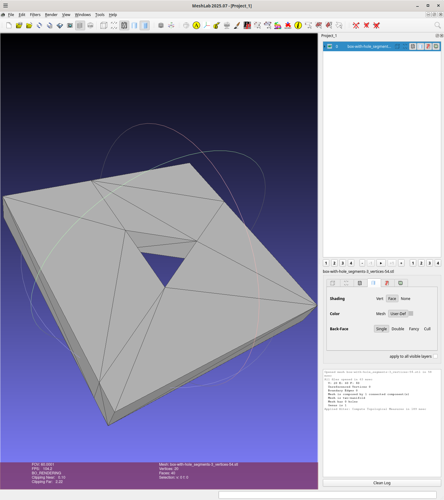
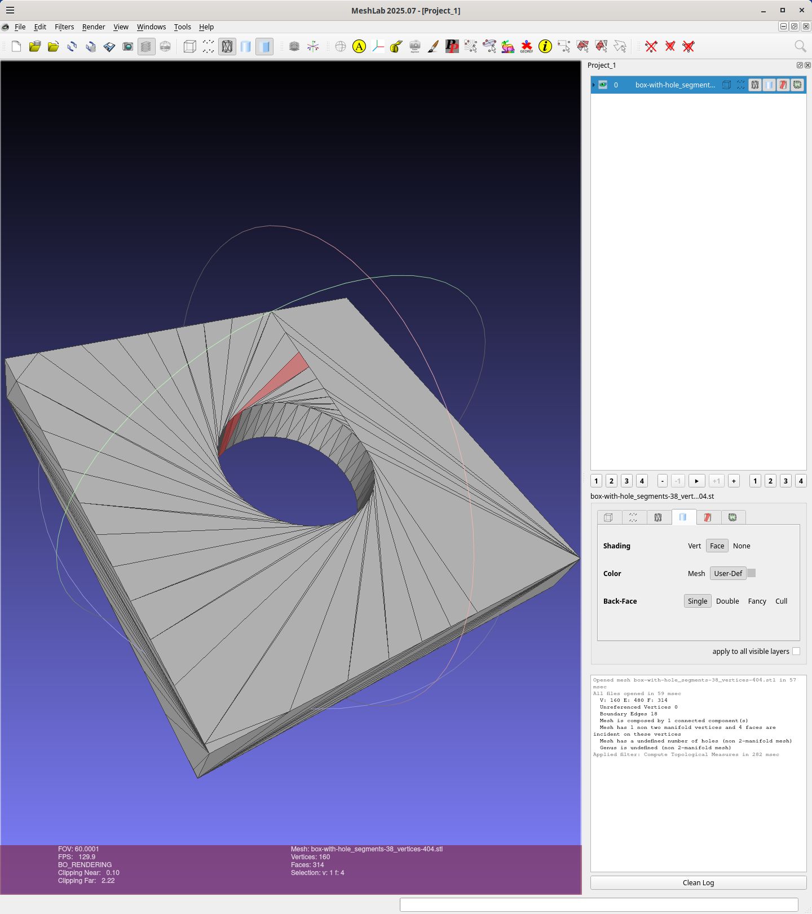

# box-with-hole

A 40x40x5mm box with a hole circumscribed by a circle with a 7.5mm radius:

Implemented using [csgrs](https://git@github.com:timschmidt/csgrs), CAD kernel
written in Rust.

The src/main.rs is based on [csgrs-holed-cuboid](https://git@github.com:winksaville/csgrs-holed-cuboid)

## Usage

Note this generates `box-with-hole` since it takes an optional paramter specifying the segment-count
```
box-with-hole <segment-count>
```

Here I'm running with no parameter so it defaults to 3 segments, a triangular hole,
and creates `box-with-hole_segments-3_vertices-54.stl`:
```
wink@3900x 25-12-06T18:40:54.668Z:~/data/prgs/3dprinting/box-with-tri-hole/csgrs (main)
$ cargo clean
     Removed 2698 files, 893.4MiB total
wink@3900x 25-12-06T18:43:02.009Z:~/data/prgs/3dprinting/box-with-tri-hole/csgrs (main)
$ cargo run --release
   Compiling proc-macro2 v1.0.103
   Compiling quote v1.0.42
   Compiling unicode-ident v1.0.22
   ..
   Compiling rapier3d-f64 v0.24.0
   Compiling csgrs v0.21.0 (https://github.com/timschmidt/csgrs.git?branch=main#82f14e32)
   Compiling box-with-hole v0.2.0 (/home/wink/data/prgs/3dprinting/box-with-tri-hole/csgrs)
    Finished `release` profile [optimized] target(s) in 12.99s
     Running `target/release/box-with-hole`
Writing file: box-with-hole_segments-3_vertices-54.stl
wink@3900x 25-12-06T18:43:16.903Z:~/data/prgs/3dprinting/box-with-tri-hole/csgrs (main)
```

Using meshlab to inspect the object using menus
[filters -> Quality Measures and Computations -> Compute Topological Measures]
and the result is perfect!
```
wink@3900x 25-12-06T18:44:51.149Z:~/data/prgs/3dprinting/box-with-tri-hole/csgrs (main)
$ meshlab box-with-hole_segments-3_vertices-54.stl
Using OpenGL 4.6
LOG: 0 Opened mesh box-with-hole_segments-3_vertices-54.stl in 58 msec
LOG: 0 All files opened in 63 msec
LOG: 2 V:     20 E:     60 F:    40
LOG: 2 Unreferenced Vertices 0
LOG: 2 Boundary Edges 0
LOG: 2 Mesh is composed by 1 connected component(s)

LOG: 2 Mesh is two-manifold
LOG: 2 Mesh has 0 holes
LOG: 2 Genus is 1
LOG: 0 Applied filter: Compute Topological Measures in 189 msec
wink@3900x 25-12-06T18:46:38.308Z:~/data/prgs/3dprinting/box-with-tri-hole/csgrs (main)
```

Here is a png:


## Binary

The binary is 571,608 bytes:
```
wink@3900x 25-12-06T18:52:35.742Z:~/data/prgs/3dprinting/box-with-tri-hole/csgrs (main)
$ ls -l target/release/box-with-hole
-rwxr-xr-x 2 wink users 571624 Dec  6 10:43 target/release/box-with-hole
wink@3900x 25-12-06T18:52:46.829Z:~/data/prgs/3dprinting/box-with-tri-hole/csgrs (main)
```

Bloat info on the binary crates:
```
wink@3900x 25-12-06T18:52:46.829Z:~/data/prgs/3dprinting/box-with-tri-hole/csgrs (main)
$ cargo bloat
   Compiling either v1.15.0
   Compiling stable_deref_trait v1.2.1
   Compiling cfg-if v1.0.4
   ..
   Compiling image v0.25.9
   Compiling dxf v0.6.0
   Compiling csgrs v0.21.0 (https://github.com/timschmidt/csgrs.git?branch=main#82f14e32)
   Compiling box-with-hole v0.2.0 (/home/wink/data/prgs/3dprinting/box-with-tri-hole/csgrs)
    Finished `dev` profile [unoptimized + debuginfo] target(s) in 15.35s
    Analyzing target/debug/box-with-hole

File  .text     Size          Crate Name
0.1%   4.9%  61.9KiB          csgrs nalgebra::linalg::inverse::do_inverse4
0.0%   2.2%  27.9KiB         robust robust::incircleadapt
0.0%   1.4%  17.8KiB matrixmultiply matrixmultiply::dgemm_kernel::kernel_target_avx
0.0%   1.3%  17.0KiB matrixmultiply matrixmultiply::dgemm_kernel::kernel_target_fma
0.0%   1.2%  15.5KiB            std std::backtrace_rs::symbolize::gimli::Cache::with_global
0.0%   1.1%  13.9KiB matrixmultiply matrixmultiply::sgemm_kernel::kernel_target_avx
0.0%   1.1%  13.5KiB         robust robust::orient3dadapt
0.0%   1.0%  13.1KiB matrixmultiply matrixmultiply::sgemm_kernel::kernel_target_fma
0.0%   1.0%  12.6KiB            std std::backtrace_rs::symbolize::gimli::Context::new
0.0%   0.9%  11.9KiB          csgrs nalgebra::linalg::inverse::<impl nalgebra::base::matrix::Matrix<T,D,D,S>>::try_inverse_mut
0.0%   0.8%   9.8KiB    parry3d_f64 nalgebra::base::blas::<impl nalgebra::base::matrix::Matrix<T,R,C,S>>::dotc
0.0%   0.8%   9.8KiB    parry3d_f64 nalgebra::base::blas::<impl nalgebra::base::matrix::Matrix<T,R,C,S>>::dot
0.0%   0.7%   9.5KiB            std gimli::read::dwarf::Unit<R>::new
0.0%   0.7%   9.1KiB            std core::cell::once::OnceCell<T>::try_init
0.0%   0.6%   7.7KiB       nalgebra nalgebra::base::ops::<impl core::ops::arith::Mul<&nalgebra::base::matrix::Matrix<T,R2,C2,SB>> for &nalgebra::base::matrix::Matrix<T,R1,C1,SA>>::mul
0.0%   0.6%   7.7KiB       nalgebra nalgebra::base::ops::<impl core::ops::arith::Mul<&nalgebra::base::matrix::Matrix<T,R2,C2,SB>> for &nalgebra::base::matrix::Matrix<T,R1,C1,SA>>::mul
0.0%   0.5%   6.8KiB          csgrs csgrs::mesh::shapes::<impl csgrs::mesh::Mesh<S>>::cuboid
0.0%   0.5%   6.5KiB    miniz_oxide miniz_oxide::inflate::core::decompress
0.0%   0.5%   6.0KiB          csgrs csgrs::mesh::Mesh<S>::fix_t_junctions_on_shared_edges
0.0%   0.4%   5.3KiB          csgrs csgrs::mesh::shapes::<impl csgrs::mesh::Mesh<S>>::frustum_ptp
0.8%  75.2% 948.8KiB                And 4192 smaller methods. Use -n N to show more.
1.1% 100.0%   1.2MiB                .text section size, the file size is 115.1MiB
wink@3900x 25-12-06T18:53:28.508Z:~/data/prgs/3dprinting/box-with-tri-hole/csgrs (main)
```

## Vertices count

The number of vertices increases linerally by 10 with each additional segment
as counted by csgrs:
```
wink@3900x 25-12-06T18:53:28.508Z:~/data/prgs/3dprinting/box-with-tri-hole/csgrs (main)
$ ./target/release/box-with-hole 3
Writing file: box-with-hole_segments-3_vertices-54.stl
wink@3900x 25-12-06T18:55:33.484Z:~/data/prgs/3dprinting/box-with-tri-hole/csgrs (main)
$ ./target/release/box-with-hole 4
Writing file: box-with-hole_segments-4_vertices-64.stl
wink@3900x 25-12-06T18:55:38.711Z:~/data/prgs/3dprinting/box-with-tri-hole/csgrs (main)
$ ./target/release/box-with-hole 5
Writing file: box-with-hole_segments-5_vertices-74.stl
wink@3900x 25-12-06T18:55:41.171Z:~/data/prgs/3dprinting/box-with-tri-hole/csgrs (main)
```

## Non 2-manifold mesh

segments=38 the first result I found that is "non 2-manifold mesh".
I found this using binary search starting at 50, the  non 2-manifold list is:
`38, 40, 43, 50`

```
wink@3900x 25-12-07T18:19:11.252Z:~/data/prgs/3dprinting/box-with-tri-hole/csgrs (main)
$ cargo run --release 38
    Finished `release` profile [optimized] target(s) in 0.08s
     Running `target/release/box-with-hole 38`
Writing file: box-with-hole_segments-38_vertices-404.stl
wink@3900x 25-12-07T18:20:17.095Z:~/data/prgs/3dprinting/box-with-tri-hole/csgrs (main)
$ meshlab box-with-hole_segments-38_vertices-404.stl 
Using OpenGL 4.6
LOG: 0 Opened mesh box-with-hole_segments-38_vertices-404.stl in 57 msec
LOG: 0 All files opened in 59 msec
LOG: 2 V:    160 E:    480 F:   314
LOG: 2 Unreferenced Vertices 0
LOG: 2 Boundary Edges 18
LOG: 2 Mesh is composed by 1 connected component(s)

LOG: 2 Mesh has 1 non two manifold vertices and 4 faces are incident on these vertices

LOG: 2 Mesh has a undefined number of holes (non 2-manifold mesh)
LOG: 2 Genus is undefined (non 2-manifold mesh)
LOG: 0 Applied filter: Compute Topological Measures in 282 msec
wink@3900x 25-12-07T18:26:09.622Z:~/data/prgs/3dprinting/box-with-tri-hole/csgrs (main)
```




## License

Licensed under either of

- Apache License, Version 2.0 ([LICENSE-APACHE](LICENSE-APACHE) or http://apache.org/licenses/LICENSE-2.0)
- MIT license ([LICENSE-MIT](LICENSE-MIT) or http://opensource.org/licenses/MIT)

### Contribution

Unless you explicitly state otherwise, any contribution intentionally submitted
for inclusion in the work by you, as defined in the Apache-2.0 license, shall
be dual licensed as above, without any additional terms or conditions.
