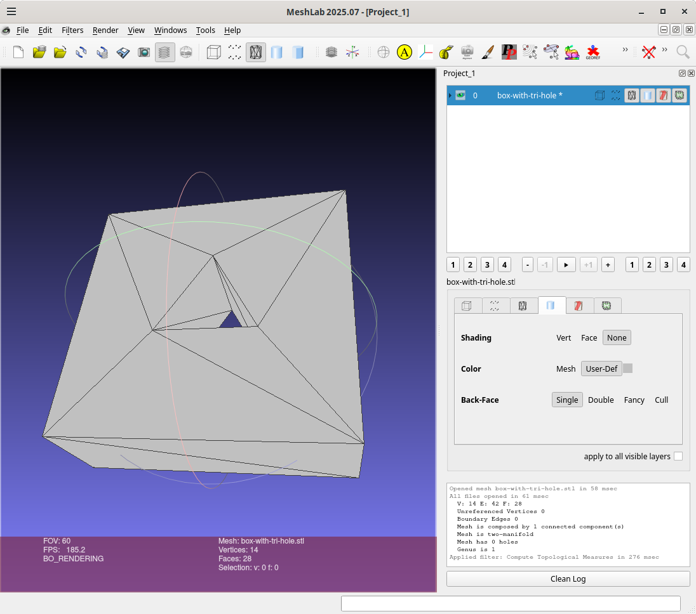

# box-with-tri-hole

This use [fornjot](https://fornjot.app/), b-rep CAD kernel
written in Rust.

The src/lib.rs and  src/main.rs are based one from fornjot/models/cuboid.
Currently I'm using a fork for fornjot which the Cargo.toml is
pointing to as things are changing.

I've created two symlinks from `~/.claude/projects` to the repos `.claude/`
allows me to save the conversations in the repo so everyone can see the
conversations I've had with the bot indepenent of which fornjot dependency
I'm using in  Cargo.toml. You are welcome to do the same and definitely
encourge it if you happen to fork this repo:
```
wink@3900x 25-11-25T01:59:46.550Z:~/data/prgs/3dprinting/box-with-tri-hole/fornjot (main)
$ ls -l ~/.claude/projects/-home-wink-data-prgs-3dprinting-box-with-tri-hole*
lrwxrwxrwx 1 wink users 57 Nov 22 12:09 /home/wink/.claude/projects/-home-wink-data-prgs-3dprinting-box-with-tri-hole -> /home/wink/data/prgs/3dprinting/box-with-tri-hole/.claude
lrwxrwxrwx 1 wink users 57 Nov 24 12:04 /home/wink/.claude/projects/-home-wink-data-prgs-3dprinting-box-with-tri-hole-fornjot -> /home/wink/data/prgs/3dprinting/box-with-tri-hole/.claude
wink@3900x 25-11-25T02:00:08.844Z:~/data/prgs/3dprinting/box-with-tri-hole/fornjot (main
```

## Usage

Here I'm running after having done a clean:
```
wink@3900x 25-11-25T01:47:07.736Z:~/data/prgs/3dprinting/box-with-tri-hole/fornjot (main)
$ cargo run
   Compiling cfg-if v1.0.4
   Compiling bitflags v2.10.0
   
   ..
   
   Compiling wayland-protocols-wlr v0.3.9
   Compiling wayland-protocols-plasma v0.3.9
   Compiling fj-math v0.49.0 (https://github.com/winksaville/fornjot?branch=dep-box-with-tri-hole#307e52b4)
   Compiling smithay-client-toolkit v0.19.2
   Compiling sctk-adwaita v0.10.1
   Compiling winit v0.30.12
   Compiling fj-interop v0.49.0 (https://github.com/winksaville/fornjot?branch=dep-box-with-tri-hole#307e52b4)
   Compiling fj-export v0.49.0 (https://github.com/winksaville/fornjot?branch=dep-box-with-tri-hole#307e52b4)
   Compiling fj-core v0.49.0 (https://github.com/winksaville/fornjot?branch=dep-box-with-tri-hole#307e52b4)
   Compiling wgpu-hal v27.0.4
   Compiling wgpu-core-deps-windows-linux-android v27.0.0
   Compiling wgpu-core v27.0.3
   Compiling wgpu v27.0.1
   Compiling fj-viewer v0.49.0 (https://github.com/winksaville/fornjot?branch=dep-box-with-tri-hole#307e52b4)
   Compiling fj v0.49.0 (https://github.com/winksaville/fornjot?branch=dep-box-with-tri-hole#307e52b4)
   Compiling box-with-tri-hole v0.1.0 (/home/wink/data/prgs/3dprinting/box-with-tri-hole/fornjot)
    Finished `dev` profile [unoptimized + debuginfo] target(s) in 12.97s
     Running `target/debug/box-with-tri-hole`
eth  base=15, half_base=7.5, tri_height=12.990381056766578, centroid_to_base=4.330127018922193, centroid_to_apex=8.660254037844386
eth  apex=[0.0, 8.660254037844386], bottom_right=[7.5, -4.330127018922193], bottom_left=[-7.5, -4.330127018922193]
wink@3900x 25-11-25T01:49:01.328Z:~/data/prgs/3dprinting/box-with-tri-hole/fornjot (main)
```

Next I use meshlab to inspect the object and used menus to select
"filters -> Quality Measures and Computations -> Compute Topological Measures"
and we have a "perfect" with the critical information being
1 connected component, Mesh is two-manifold, Mesh has 0 holes":
```
wink@3900x 25-11-25T01:34:29.508Z:~/data/prgs/3dprinting/box-with-tri-hole/fornjot (main)
$ meshlab box-with-tri-hole.stl 
Using OpenGL 4.6
LOG: 0 Opened mesh box-with-tri-hole.stl in 63 msec
LOG: 0 All files opened in 73 msec
LOG: 2 V:     14 E:     42 F:    28
LOG: 2 Unreferenced Vertices 0
LOG: 2 Boundary Edges 0
LOG: 2 Mesh is composed by 1 connected component(s)

LOG: 2 Mesh is two-manifold 
LOG: 2 Mesh has 0 holes
LOG: 2 Genus is 1
LOG: 0 Applied filter: Compute Topological Measures in 97 msec
wink@3900x 25-11-25T01:34:58.188Z:~/data/prgs/3dprinting/box-with-tri-hole/fornjot (main)
```

And here is a image:


## Example

```
wink@3900x 25-11-19T19:33:45.307Z:~/data/3D-Graphics-CAD-CAM/3D-models/box-with-tri-hole/fornjot (main)
$ cargo run -- -e box-with-tri-hole.stl --x 40 --y 40 --z 15
    Finished `dev` profile [unoptimized + debuginfo] target(s) in 0.12s
     Running `target/debug/cuboid -e box-with-tri-hole.stl --x 40 --y 40 --z 15`
wink@3900x 25-11-19T19:35:25.131Z:~/data/3D-Graphics-CAD-CAM/3D-models/box-with-tri-hole/fornjot (main)
$ f3d box-with-tri-hole.stl --output box-with-tri-hole.stl.png
wink@3900x 25-11-19T19:35:42.275Z:~/data/3D-Graphics-CAD-CAM/3D-models/box-with-tri-hole/fornjot (main)
```


## License

Licensed under either of

- Apache License, Version 2.0 ([LICENSE-APACHE](LICENSE-APACHE) or http://apache.org/licenses/LICENSE-2.0)
- MIT license ([LICENSE-MIT](LICENSE-MIT) or http://opensource.org/licenses/MIT)

### Contribution

Unless you explicitly state otherwise, any contribution intentionally submitted
for inclusion in the work by you, as defined in the Apache-2.0 license, shall
be dual licensed as above, without any additional terms or conditions.
