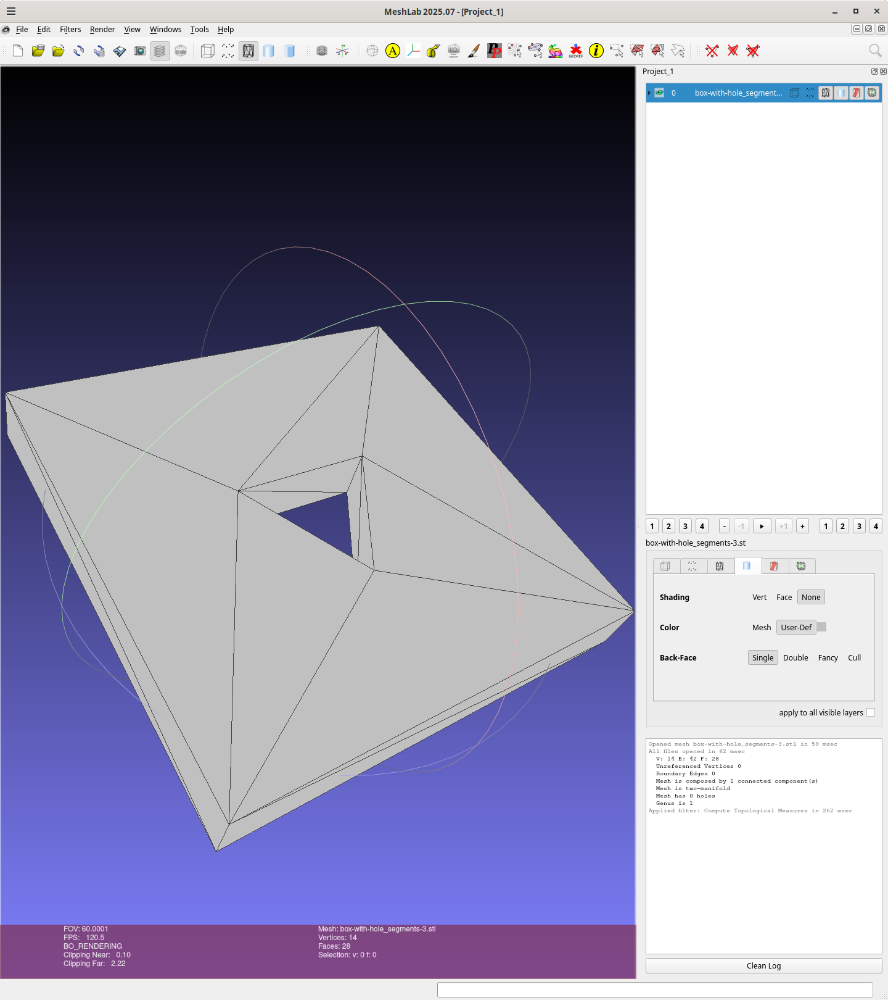
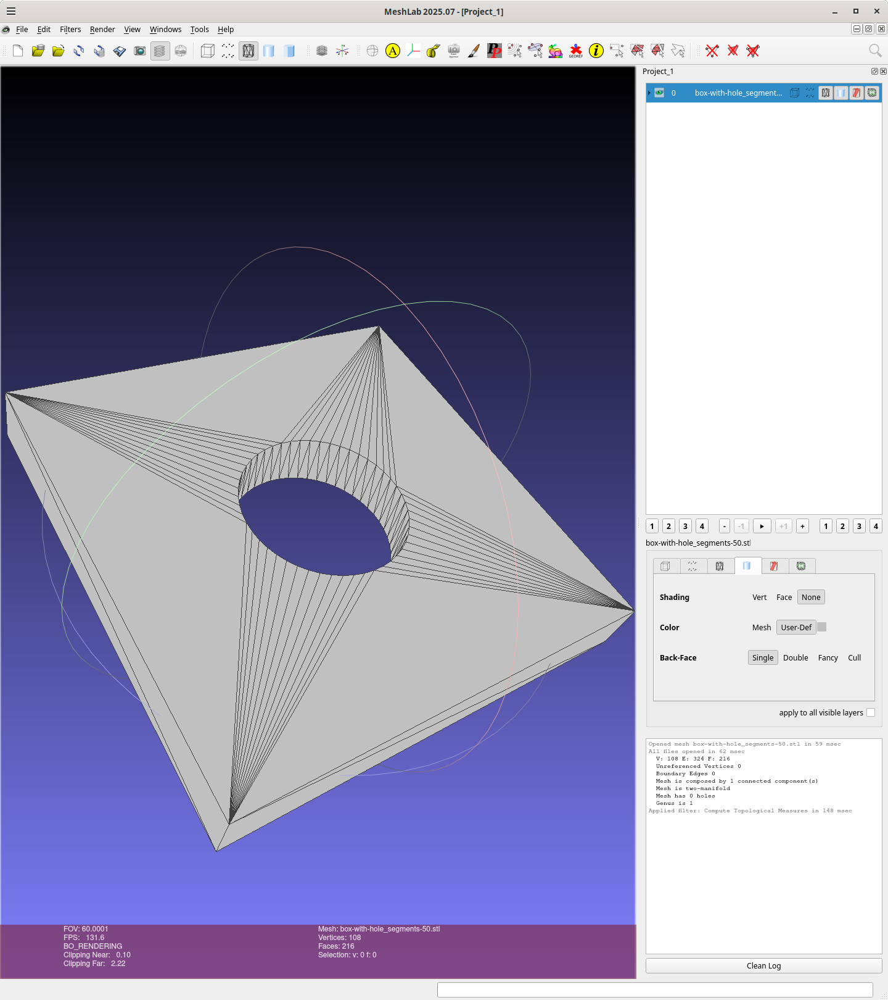

# box-with-tri-hole

A 40x40x5mm box with a hole circumscribed by a circle with a 7.5mm radius:

Implemented using [fornjot](https://fornjot.app/), b-rep CAD kernel
written in Rust.

The src/lib.rs and  src/main.rs are based one from fornjot/models/cuboid.
Currently I'm using a fork for fornjot which the Cargo.toml is
pointing to as things are changing.

## Usage

Note this generates `box-with-hole` since it takes an optional paramter specifying the segment-count
```
box-with-hole <segment-count>
```

Here I'm running with no parameter so it defaults to 3 segments, a triangular hole,
and creates `box-with-hole_segments-3_vertices-54.stl`:
```
wink@3900x 25-11-29T19:22:59.667Z:~/data/prgs/3dprinting/box-with-tri-hole/fornjot (main)
$ cargo clean
     Removed 3855 files, 1.5GiB total
wink@3900x 25-11-29T19:23:21.151Z:~/data/prgs/3dprinting/box-with-tri-hole/fornjot (main)
$ cargo run --release
   Compiling proc-macro2 v1.0.103
   Compiling unicode-ident v1.0.22
   Compiling quote v1.0.42
..
   Compiling threemf v0.7.0
   Compiling parry2d-f64 v0.25.3
   Compiling parry3d-f64 v0.25.3
   Compiling fj-math v0.49.0 (https://github.com/winksaville/fornjot?branch=dep-box-with-tri-hole#307e52b4)
   Compiling fj-interop v0.49.0 (https://github.com/winksaville/fornjot?branch=dep-box-with-tri-hole#307e52b4)
   Compiling fj-core v0.49.0 (https://github.com/winksaville/fornjot?branch=dep-box-with-tri-hole#307e52b4)
   Compiling fj-export v0.49.0 (https://github.com/winksaville/fornjot?branch=dep-box-with-tri-hole#307e52b4)
   Compiling wgpu-core-deps-windows-linux-android v27.0.0
   Compiling fj-viewer v0.49.0 (https://github.com/winksaville/fornjot?branch=dep-box-with-tri-hole#307e52b4)
   Compiling fj v0.49.0 (https://github.com/winksaville/fornjot?branch=dep-box-with-tri-hole#307e52b4)
   Compiling box-with-hole v0.2.0 (/home/wink/data/prgs/3dprinting/box-with-tri-hole/fornjot)
    Finished `release` profile [optimized] target(s) in 22.03s
     Running `target/release/box-with-hole`
Writing file: box-with-hole_segments-3.stl
wink@3900x 25-12-07T06:28:53.161Z:~/data/prgs/3dprinting/box-with-tri-hole/fornjot (main)
```

Using meshlab to inspect the object using menus
[filters -> Quality Measures and Computations -> Compute Topological Measures]
and the results are perfect:
```
wink@3900x 25-11-29T19:24:34.214Z:~/data/prgs/3dprinting/box-with-tri-hole/fornjot (main)
$ meshlab box-with-tri-hole.stl 
Using OpenGL 4.6
LOG: 0 Opened mesh box-with-tri-hole.stl in 47 msec
LOG: 0 All files opened in 54 msec
LOG: 2 V:     14 E:     42 F:    28
LOG: 2 Unreferenced Vertices 0
LOG: 2 Boundary Edges 0
LOG: 2 Mesh is composed by 1 connected component(s)

LOG: 2 Mesh is two-manifold 
LOG: 2 Mesh has 0 holes
LOG: 2 Genus is 1
LOG: 0 Applied filter: Compute Topological Measures in 278 msec
```

And here is a image:


## Binary

The binary is 1,205,424 bytes:
```
wink@3900x 25-12-07T06:35:50.167Z:~/data/prgs/3dprinting/box-with-tri-hole/fornjot (main)
$ ls  -l target/release/box-with-hole
-rwxr-xr-x 2 wink users 1205424 Dec  6 22:28 target/release/box-with-hole
wink@3900x 25-12-07T06:36:10.672Z:~/data/prgs/3dprinting/box-with-tri-hole/fornjot (main)
```

Bloat info on the binary crates:
```
wink@3900x 25-12-07T06:36:10.672Z:~/data/prgs/3dprinting/box-with-tri-hole/fornjot (main)
$ cargo bloat --crates
   Compiling proc-macro2 v1.0.103
   Compiling quote v1.0.42
   Compiling unicode-ident v1.0.22
   ..
   Compiling parry2d-f64 v0.25.3
   Compiling wgpu-core-deps-windows-linux-android v27.0.0
   Compiling fj-math v0.49.0 (https://github.com/winksaville/fornjot?branch=dep-box-with-tri-hole#307e52b4)
   Compiling fj-interop v0.49.0 (https://github.com/winksaville/fornjot?branch=dep-box-with-tri-hole#307e52b4)
   Compiling fj-export v0.49.0 (https://github.com/winksaville/fornjot?branch=dep-box-with-tri-hole#307e52b4)
   Compiling fj-core v0.49.0 (https://github.com/winksaville/fornjot?branch=dep-box-with-tri-hole#307e52b4)
   Compiling fj-viewer v0.49.0 (https://github.com/winksaville/fornjot?branch=dep-box-with-tri-hole#307e52b4)
   Compiling fj v0.49.0 (https://github.com/winksaville/fornjot?branch=dep-box-with-tri-hole#307e52b4)
   Compiling box-with-hole v0.2.0 (/home/wink/data/prgs/3dprinting/box-with-tri-hole/fornjot)
    Finished `dev` profile [unoptimized + debuginfo] target(s) in 28.95s
    Analyzing target/debug/box-with-hole

File  .text     Size Crate
0.6%  38.8%   1.3MiB fj_core
0.3%  17.6% 601.5KiB std
0.1%   7.4% 255.2KiB zopfli
0.1%   6.1% 210.0KiB matrixmultiply
0.1%   4.1% 141.3KiB quick_xml
0.1%   3.3% 112.3KiB zip
0.0%   3.1% 105.3KiB miniz_oxide
0.0%   1.8%  60.1KiB parry3d_f64
0.0%   1.5%  51.1KiB fj_math
0.0%   1.3%  43.2KiB threemf
0.0%   1.1%  39.2KiB robust
0.0%   1.0%  35.3KiB parking_lot
0.0%   1.0%  34.0KiB simd_adler32
0.0%   1.0%  33.4KiB serde_core
0.0%   0.7%  23.7KiB parking_lot_core
0.0%   0.6%  21.8KiB wavefront_rs
0.0%   0.6%  19.5KiB hashbrown
0.0%   0.5%  16.7KiB parry2d_f64
0.0%   0.4%  13.8KiB type_map
0.0%   0.4%  12.2KiB x11rb_protocol
0.1%   4.9% 166.5KiB And 68 more crates. Use -n N to show more.
1.6% 100.0%   3.3MiB .text section size, the file size is 213.1MiB

Note: numbers above are a result of guesswork. They are not 100% correct and never will be.
wink@3900x 25-12-07T06:38:48.886Z:~/data/prgs/3dprinting/box-with-tri-hole/fornjot (main)
```

### 50 segment hole

```
wink@3900x 25-12-07T06:41:57.223Z:~/data/prgs/3dprinting/box-with-tri-hole/fornjot (main)
$ ./target/release/box-with-hole 50
Writing file: box-with-hole_segments-50.stl
wink@3900x 25-12-07T06:42:10.491Z:~/data/prgs/3dprinting/box-with-tri-hole/fornjot (main)
$ meshlab box-with-hole_segments-50.stl
Using OpenGL 4.6
LOG: 0 Opened mesh box-with-hole_segments-50.stl in 59 msec
LOG: 0 All files opened in 62 msec
LOG: 2 V:    108 E:    324 F:   216
LOG: 2 Unreferenced Vertices 0
LOG: 2 Boundary Edges 0
LOG: 2 Mesh is composed by 1 connected component(s)

LOG: 2 Mesh is two-manifold
LOG: 2 Mesh has 0 holes
LOG: 2 Genus is 1
LOG: 0 Applied filter: Compute Topological Measures in 148 msec
wink@3900x 25-12-07T06:49:39.903Z:~/data/prgs/3dprinting/box-with-tri-hole/fornjot (main)
```



## License

Licensed under either of

- Apache License, Version 2.0 ([LICENSE-APACHE](LICENSE-APACHE) or http://apache.org/licenses/LICENSE-2.0)
- MIT license ([LICENSE-MIT](LICENSE-MIT) or http://opensource.org/licenses/MIT)

### Contribution

Unless you explicitly state otherwise, any contribution intentionally submitted
for inclusion in the work by you, as defined in the Apache-2.0 license, shall
be dual licensed as above, without any additional terms or conditions.
