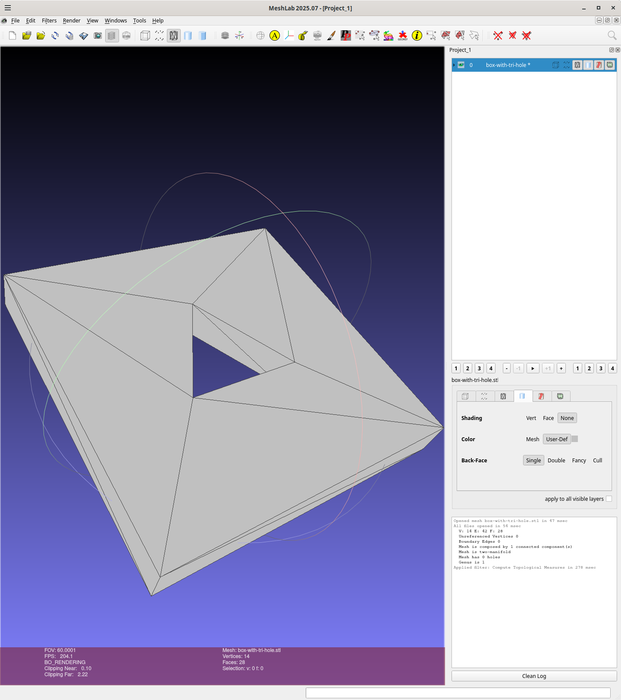

# box-with-tri-hole

A 40x40x5mm box with a triangular hole circumscribed by a circle with a 7.5mm radius:

Implemented using [fornjot](https://fornjot.app/), b-rep CAD kernel
written in Rust.

The src/lib.rs and  src/main.rs are based one from fornjot/models/cuboid.
Currently I'm using a fork for fornjot which the Cargo.toml is
pointing to as things are changing.

## Usage

Here I'm running after having done a clean:
```
wink@3900x 25-11-29T19:22:59.667Z:~/data/prgs/3dprinting/box-with-tri-hole/fornjot (main)
$ cargo clean
     Removed 3855 files, 1.5GiB total
wink@3900x 25-11-29T19:23:21.151Z:~/data/prgs/3dprinting/box-with-tri-hole/fornjot (main)
$ cargo run --release
   Compiling proc-macro2 v1.0.103
   Compiling unicode-ident v1.0.22
   Compiling quote v1.0.42
..
   Compiling parry3d-f64 v0.25.3
   Compiling fj-math v0.49.0 (https://github.com/winksaville/fornjot?branch=dep-box-with-tri-hole#307e52b4)
   Compiling fj-interop v0.49.0 (https://github.com/winksaville/fornjot?branch=dep-box-with-tri-hole#307e52b4)
   Compiling fj-core v0.49.0 (https://github.com/winksaville/fornjot?branch=dep-box-with-tri-hole#307e52b4)
   Compiling fj-export v0.49.0 (https://github.com/winksaville/fornjot?branch=dep-box-with-tri-hole#307e52b4)
   Compiling wgpu-core-deps-windows-linux-android v27.0.0
   Compiling fj-viewer v0.49.0 (https://github.com/winksaville/fornjot?branch=dep-box-with-tri-hole#307e52b4)
   Compiling fj v0.49.0 (https://github.com/winksaville/fornjot?branch=dep-box-with-tri-hole#307e52b4)
   Compiling box-with-tri-hole v0.1.0 (/home/wink/data/prgs/3dprinting/box-with-tri-hole/fornjot)
    Finished `release` profile [optimized] target(s) in 1m 09s
     Running `target/release/box-with-tri-hole`
eth  base=15, half_base=7.5, tri_height=12.990381056766578, centroid_to_base=4.330127018922193, centroid_to_apex=8.660254037844386
eth  apex=[0.0, 8.660254037844386], bottom_right=[7.5, -4.330127018922193], bottom_left=[-7.5, -4.330127018922193]
wink@3900x 25-11-29T19:24:34.214Z:~/data/prgs/3dprinting/box-with-tri-hole/fornjot (main)
```

Using meshlab to inspect the object using menus
[filters -> Quality Measures and Computations -> Compute Topological Measures]
and the results are perfect:
```
wink@3900x 25-11-29T19:24:34.214Z:~/data/prgs/3dprinting/box-with-tri-hole/fornjot (main)
$ meshlab box-with-tri-hole.stl 
Using OpenGL 4.6
LOG: 0 Opened mesh box-with-tri-hole.stl in 47 msec
LOG: 0 All files opened in 54 msec
LOG: 2 V:     14 E:     42 F:    28
LOG: 2 Unreferenced Vertices 0
LOG: 2 Boundary Edges 0
LOG: 2 Mesh is composed by 1 connected component(s)

LOG: 2 Mesh is two-manifold 
LOG: 2 Mesh has 0 holes
LOG: 2 Genus is 1
LOG: 0 Applied filter: Compute Topological Measures in 278 msec
```

And here is a image:


## Binary

The binary is 10,055,240 bytes:
```
wink@3900x 25-11-29T19:36:24.158Z:~/data/prgs/3dprinting/box-with-tri-hole/fornjot (main)
$ ls -l target/release/box-with-tri-hole
-rwxr-xr-x 2 wink users 10055240 Nov 29 11:24 target/release/box-with-tri-hole
wink@3900x 25-11-29T19:36:35.141Z:~/data/prgs/3dprinting/box-with-tri-hole/fornjot (main)
```

Bloat info on the binary crates:
```
wink@3900x 25-11-29T19:38:58.174Z:~/data/prgs/3dprinting/box-with-tri-hole/fornjot (main)
$ cargo bloat --crates
   Compiling proc-macro2 v1.0.103
   Compiling unicode-ident v1.0.22
   Compiling quote v1.0.42
..
   Compiling threemf v0.7.0
   Compiling parry2d-f64 v0.25.3
   Compiling parry3d-f64 v0.25.3
   Compiling fj-math v0.49.0 (https://github.com/winksaville/fornjot?branch=dep-box-with-tri-hole#307e52b4)
   Compiling fj-interop v0.49.0 (https://github.com/winksaville/fornjot?branch=dep-box-with-tri-hole#307e52b4)
   Compiling fj-core v0.49.0 (https://github.com/winksaville/fornjot?branch=dep-box-with-tri-hole#307e52b4)
   Compiling fj-export v0.49.0 (https://github.com/winksaville/fornjot?branch=dep-box-with-tri-hole#307e52b4)
   Compiling wgpu-core-deps-windows-linux-android v27.0.0
   Compiling fj-viewer v0.49.0 (https://github.com/winksaville/fornjot?branch=dep-box-with-tri-hole#307e52b4)
   Compiling fj v0.49.0 (https://github.com/winksaville/fornjot?branch=dep-box-with-tri-hole#307e52b4)
   Compiling box-with-tri-hole v0.1.0 (/home/wink/data/prgs/3dprinting/box-with-tri-hole/fornjot)
    Finished `dev` profile [unoptimized + debuginfo] target(s) in 9.78s
    Analyzing target/debug/box-with-tri-hole

File  .text     Size Crate
1.7%  19.2%   4.5MiB naga
1.1%  12.5%   2.9MiB wgpu_core
0.7%   7.2%   1.7MiB wgpu_hal
0.6%   6.5%   1.5MiB winit
0.5%   5.6%   1.3MiB fj_core
0.4%   4.6%   1.1MiB std
0.3%   3.6% 861.3KiB clap_builder
0.3%   3.0% 726.1KiB tiny_skia
0.2%   2.6% 633.0KiB regex_automata
0.2%   2.2% 538.5KiB image
0.2%   2.0% 492.9KiB regex_syntax
0.1%   1.5% 365.2KiB wgpu
0.1%   1.5% 363.8KiB tracing_subscriber
0.1%   1.4% 342.4KiB fj_viewer
0.1%   1.1% 271.7KiB x11rb_protocol
0.1%   1.1% 271.3KiB ttf_parser
0.1%   1.1% 255.2KiB zopfli
0.1%   1.0% 235.8KiB x11_dl
0.1%   0.9% 216.9KiB wayland_client
0.1%   0.9% 210.0KiB matrixmultiply
1.5%  17.0%   4.0MiB And 130 more crates. Use -n N to show more.
9.1% 100.0%  23.5MiB .text section size, the file size is 259.2MiB

Note: numbers above are a result of guesswork. They are not 100% correct and never will be.
wink@3900x 25-11-29T19:39:10.631Z:~/data/prgs/3dprinting/box-with-tri-hole/fornjot (main)
```

## License

Licensed under either of

- Apache License, Version 2.0 ([LICENSE-APACHE](LICENSE-APACHE) or http://apache.org/licenses/LICENSE-2.0)
- MIT license ([LICENSE-MIT](LICENSE-MIT) or http://opensource.org/licenses/MIT)

### Contribution

Unless you explicitly state otherwise, any contribution intentionally submitted
for inclusion in the work by you, as defined in the Apache-2.0 license, shall
be dual licensed as above, without any additional terms or conditions.
